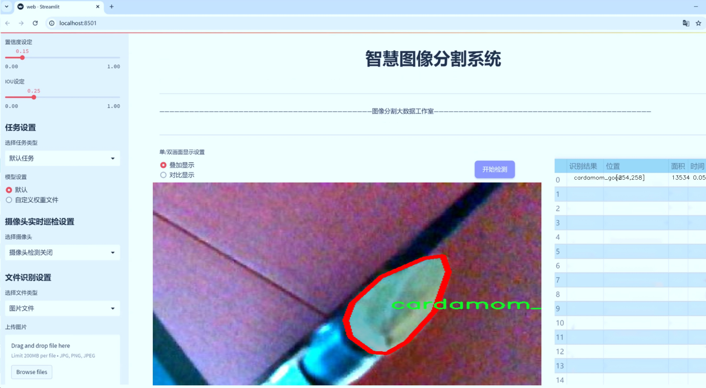

# 豆蔻品质分割系统： yolov8-seg-EfficientHead

### 1.研究背景与意义

[参考博客](https://gitee.com/YOLOv8_YOLOv11_Segmentation_Studio/projects)

[博客来源](https://kdocs.cn/l/cszuIiCKVNis)

研究背景与意义

随着全球经济的发展和人们生活水平的提高，农产品的品质和安全性日益受到重视。豆蔻作为一种重要的香料和药用植物，其品质直接影响到食品的风味和营养价值。豆蔻的市场需求不断增长，尤其是在国际贸易中，优质豆蔻的价值更是显著。因此，如何有效地对豆蔻进行品质评估和分级，成为了农业生产和市场流通中的一项重要任务。

传统的豆蔻品质评估方法多依赖于人工目测和简单的物理化学检测，这不仅耗时耗力，而且主观性强，容易导致评估结果的不一致性和误差。随着计算机视觉技术的快速发展，基于深度学习的图像处理方法逐渐成为品质评估的新兴手段。YOLO（You Only Look Once）系列模型以其高效的实时目标检测能力，已在多个领域取得了显著的应用效果。然而，针对豆蔻品质分割的研究仍然相对较少，尤其是对坏豆蔻与好豆蔻的精准识别和分割。

本研究旨在基于改进的YOLOv8模型，构建一个高效的豆蔻品质分割系统。通过利用包含2100张图像的“豆蔻好坏”数据集，我们将实现对豆蔻图像中好豆蔻与坏豆蔻的精准分割与分类。该数据集包含两个类别：cardamom_good和cardamom_bad，涵盖了豆蔻的不同生长阶段和环境条件下的图像，具有较高的代表性和多样性。这为模型的训练和测试提供了丰富的样本，有助于提高分割系统的鲁棒性和准确性。

改进YOLOv8模型的应用，不仅能够提升豆蔻品质分割的精度，还能显著提高处理速度，使得实时监测成为可能。这对于农业生产中的质量控制、仓储管理以及市场流通环节都具有重要的实际意义。通过自动化的品质分割系统，农民和商家可以快速识别出不合格的豆蔻，减少经济损失，提高产品的市场竞争力。此外，该系统的推广应用也将推动农业数字化转型，促进智能农业的发展。

综上所述，基于改进YOLOv8的豆蔻品质分割系统的研究，不仅具有重要的理论价值，也具备广泛的应用前景。通过深入探索计算机视觉技术在农产品品质评估中的应用，我们希望能够为豆蔻产业的可持续发展提供新的解决方案，同时为其他农产品的品质检测提供借鉴和参考。这一研究将为实现农业现代化、提高农产品附加值、保障食品安全做出积极贡献。

### 2.图片演示




注意：本项目提供完整的训练源码数据集和训练教程,由于此博客编辑较早,暂不提供权重文件（best.pt）,需要按照6.训练教程进行训练后实现上图效果。

### 3.视频演示

[3.1 视频演示](https://www.bilibili.com/video/BV1cYB1YYEVY/)

### 4.数据集信息

##### 4.1 数据集类别数＆类别名

nc: 2
names: ['cardamom_bad', 'cardamom_good']


##### 4.2 数据集信息简介

数据集信息展示

在本研究中，我们使用了名为“Cardamom good bad”的数据集，以训练和改进YOLOv8-seg模型，旨在实现对豆蔻品质的精确分割与分类。该数据集专注于豆蔻的品质评估，具体分为两大类：优质豆蔻（cardamom_good）和劣质豆蔻（cardamom_bad）。通过对这两类的细致标注和分类，我们希望能够提升模型在实际应用中的准确性和可靠性。

“Cardamom good bad”数据集包含了多样化的豆蔻图像，这些图像来源于不同的采集环境和光照条件，确保了数据集的广泛性和代表性。每一张图像都经过精心的标注，标注过程不仅考虑了豆蔻的外观特征，还综合了其生长环境、成熟度以及潜在的病虫害影响等因素。这种多维度的标注方式，使得数据集在训练过程中能够提供丰富的信息，帮助模型更好地学习和识别豆蔻的品质特征。

在数据集的构建过程中，我们特别关注了样本的均衡性，确保优质和劣质豆蔻的样本数量相对接近，以避免模型在训练时出现偏向某一类别的现象。这样的设计不仅提高了模型的泛化能力，也增强了其在实际应用中的实用性。例如，在农田管理和豆蔻生产过程中，能够及时识别出劣质豆蔻，从而帮助农民做出更为科学的决策，提升整体产量和品质。

此外，数据集的图像分辨率和质量也经过严格把控，确保每张图像都能够清晰地展示豆蔻的细节特征。这对于YOLOv8-seg模型的训练至关重要，因为高质量的输入数据能够显著提高模型的学习效率和最终的分割效果。通过使用该数据集，我们希望模型能够准确地分割出豆蔻的不同部分，并有效地区分优质与劣质豆蔻。

在模型训练的过程中，我们将采用数据增强技术，以进一步提升模型的鲁棒性和适应性。通过旋转、缩放、裁剪等方式生成更多的训练样本，模型将能够在面对不同的环境和条件时，依然保持较高的识别准确率。这种方法不仅能够丰富数据集的多样性，还能有效防止模型的过拟合现象。

综上所述，“Cardamom good bad”数据集为我们改进YOLOv8-seg模型提供了坚实的基础。通过对豆蔻品质的精准分割与分类，我们希望能够为豆蔻的生产和管理提供更为科学的支持，推动相关领域的技术进步和产业发展。随着模型的不断优化，我们期待在未来的应用中，能够实现更高效的豆蔻品质监测和管理，为农民和相关企业带来实际的经济效益。


### 5.项目依赖环境部署教程（零基础手把手教学）

[5.1 环境部署教程链接（零基础手把手教学）](https://www.bilibili.com/video/BV1jG4Ve4E9t/?vd_source=bc9aec86d164b67a7004b996143742dc)


[5.2 安装Python虚拟环境创建和依赖库安装视频教程链接（零基础手把手教学）](https://www.bilibili.com/video/BV1nA4VeYEze/?vd_source=bc9aec86d164b67a7004b996143742dc)

### 6.手把手YOLOV8-seg训练视频教程（零基础手把手教学）

[6.1 手把手YOLOV8-seg训练视频教程（零基础小白有手就能学会）](https://www.bilibili.com/video/BV1cA4VeYETe/?vd_source=bc9aec86d164b67a7004b996143742dc)


按照上面的训练视频教程链接加载项目提供的数据集，运行train.py即可开始训练



     Epoch   gpu_mem       box       obj       cls    labels  img_size
     1/200     0G   0.01576   0.01955  0.007536        22      1280: 100%|██████████| 849/849 [14:42<00:00,  1.04s/it]
               Class     Images     Labels          P          R     mAP@.5 mAP@.5:.95: 100%|██████████| 213/213 [01:14<00:00,  2.87it/s]
                 all       3395      17314      0.994      0.957      0.0957      0.0843

     Epoch   gpu_mem       box       obj       cls    labels  img_size
     2/200     0G   0.01578   0.01923  0.007006        22      1280: 100%|██████████| 849/849 [14:44<00:00,  1.04s/it]
               Class     Images     Labels          P          R     mAP@.5 mAP@.5:.95: 100%|██████████| 213/213 [01:12<00:00,  2.95it/s]
                 all       3395      17314      0.996      0.956      0.0957      0.0845

     Epoch   gpu_mem       box       obj       cls    labels  img_size
     3/200     0G   0.01561    0.0191  0.006895        27      1280: 100%|██████████| 849/849 [10:56<00:00,  1.29it/s]
               Class     Images     Labels          P          R     mAP@.5 mAP@.5:.95: 100%|███████   | 187/213 [00:52<00:00,  4.04it/s]
                 all       3395      17314      0.996      0.957      0.0957      0.0845


### 7.50+种全套YOLOV8-seg创新点加载调参实验视频教程（一键加载写好的改进模型的配置文件）

[7.1 50+种全套YOLOV8-seg创新点加载调参实验视频教程（一键加载写好的改进模型的配置文件）](https://www.bilibili.com/video/BV1Hw4VePEXv/?vd_source=bc9aec86d164b67a7004b996143742dc)

### YOLOV8-seg算法简介

原始YOLOv8-seg算法原理

YOLOv8-seg作为YOLO系列的最新进展，代表了目标检测和分割领域的前沿技术。该算法在YOLOv5的基础上进行了多项创新，尤其是在检测精度和速度方面的显著提升，使其在实际应用中更具竞争力。YOLOv8-seg的设计旨在处理复杂的视觉任务，特别是对图像中物体的精确定位和分割，具有广泛的应用潜力。

YOLOv8-seg的网络结构主要由四个部分组成：输入端、骨干网络、颈部网络和头部网络。输入端采用了马赛克数据增强、自适应锚框计算和自适应灰度填充等技术，以提高模型的鲁棒性和适应性。马赛克增强通过将多张图像拼接在一起，生成新的训练样本，从而增加了数据的多样性，有助于模型在不同场景下的泛化能力。自适应锚框计算则通过动态调整锚框的大小和比例，使得模型能够更好地适应不同尺寸和形状的目标，提高了检测的准确性。

在骨干网络部分，YOLOv8-seg引入了C2f模块和SPPF（Spatial Pyramid Pooling Fusion）结构。C2f模块的设计灵感来源于YOLOv7的ELAN结构，通过增加更多的分支和跨层连接，增强了模型的梯度流动性，从而提升了特征表示能力。这种结构不仅提高了特征提取的效率，还使得模型在处理复杂场景时能够更好地捕捉细节信息。SPPF模块则通过多尺度特征融合，进一步提高了模型的计算速度和精度，使得YOLOv8-seg在实时检测任务中表现优异。

颈部网络采用了路径聚合网络（PAN）结构，这一设计旨在增强网络对不同缩放尺度对象的特征融合能力。PAN结构通过有效地结合高层和低层特征，使得模型能够在不同的空间尺度上进行信息整合，从而提高了对小目标和大目标的检测能力。这种特征融合策略在YOLOv8-seg中发挥了关键作用，使得模型在复杂背景下仍能保持较高的检测精度。

头部网络则是YOLOv8-seg的核心部分，主要负责分类和检测的解耦。与传统的耦合头结构不同，YOLOv8-seg采用了当前流行的解耦头结构，将分类和检测过程分开进行。这一设计使得模型在处理任务时能够更加灵活，分类和检测的损失计算分别进行，能够更好地优化模型性能。在损失计算方面，YOLOv8-seg使用了Task-Aligned Assigner分配策略，依据分类与回归的分数加权结果选择正样本，从而提高了训练的效率和效果。

在具体的损失函数设计上，YOLOv8-seg结合了二元交叉熵损失（BCELoss）和分布焦点损失（DFLoss）以及完全交并比损失函数（CIOULoss），以提升模型对边界框预测的精准性。BCELoss用于分类任务，DFLoss和CIOULoss则针对回归任务进行优化，这种组合损失函数的设计使得模型在面对复杂场景时，能够更好地平衡分类和回归的性能。

YOLOv8-seg的创新之处不仅体现在网络结构的改进上，还包括对数据增强策略的优化。在训练过程中，YOLOv8-seg在最后10个epoch关闭马赛克增强，采用动态的Task-Aligned Assigner样本分配策略，这些改进使得模型在训练后期能够更好地集中于难以分类的样本，从而提升整体的检测精度。

此外，YOLOv8-seg在模型的轻量化方面也做出了显著贡献。通过对不同尺度模型调整通道数，YOLOv8-seg在保证性能的同时，减少了模型的参数量，使得其在资源受限的环境中也能高效运行。这种轻量化设计不仅提升了模型的实时性，还为在移动设备和边缘计算场景中的应用提供了可能。

综上所述，YOLOv8-seg算法通过一系列创新设计，极大地提升了目标检测和分割的性能。其在网络结构、损失函数、数据增强策略以及模型轻量化等方面的改进，使得YOLOv8-seg在处理复杂视觉任务时展现出更强的能力。随着YOLOv8-seg的不断发展和完善，预计将在自动驾驶、智能监控、医疗影像分析等领域发挥越来越重要的作用。


### 9.系统功能展示（检测对象为举例，实际内容以本项目数据集为准）

图9.1.系统支持检测结果表格显示

  图9.2.系统支持置信度和IOU阈值手动调节

  图9.3.系统支持自定义加载权重文件best.pt(需要你通过步骤5中训练获得)

  图9.4.系统支持摄像头实时识别

  图9.5.系统支持图片识别

  图9.6.系统支持视频识别

  图9.7.系统支持识别结果文件自动保存

  图9.8.系统支持Excel导出检测结果数据


### 10.50+种全套YOLOV8-seg创新点原理讲解（非科班也可以轻松写刊发刊，V11版本正在科研待更新）

#### 10.1 由于篇幅限制，每个创新点的具体原理讲解就不一一展开，具体见下列网址中的创新点对应子项目的技术原理博客网址【Blog】：


[10.1 50+种全套YOLOV8-seg创新点原理讲解链接](https://gitee.com/qunmasj/good)

#### 10.2 部分改进模块原理讲解(完整的改进原理见上图和技术博客链接)【如果此小节的图加载失败可以通过CSDN或者Github搜索该博客的标题访问原始博客，原始博客图片显示正常】
### 可变性卷积DCN简介
卷积神经网络由于其构建模块中固定的几何结构，本质上受限于模型几何变换。为了提高卷积神经网络的转换建模能力，《Deformable Convolutional Networks》作者提出了两个模块：可变形卷积（deformable convolution）和可变形RoI池（deformable RoI pooling）。这两个模块均基于用额外的偏移来增加模块中的空间采样位置以及从目标任务中学习偏移的思想，而不需要额外的监督。

第一次证明了在深度神经网络中学习密集空间变换（dense spatial transformation）对于复杂的视觉任务是有效的

视觉识别中的一个关键挑战是如何适应对象比例、姿态、视点和零件变形中的几何变化或模型几何变换。一般有两种方法实现：
1）建立具有足够期望变化的训练数据集。这通常通过增加现有的数据样本来实现，例如通过仿射变换。但是训练成本昂贵而且模型参数庞大。
2）使用变换不变（transformation-invariant）的特征和算法。比如比较有名的SIFT(尺度不变特征变换)便是这一类的代表算法。

但以上的方法有两个缺点：
1）几何变换被假定为固定的和已知的，这些先验知识被用来扩充数据，设计特征和算法。为此，这个假设阻止了对具有未知几何变换的新任务的推广，从而导致这些几何变换可能没有被正确建模。
2）对于不变特征和算法进行手动设计，对于过于复杂的变换可能是困难的或不可行的。

卷积神经网络本质上局限于模拟大型未知转换。局限性源于CNN模块的固定几何结构：卷积单元在固定位置对输入特征图进行采样；池化层以固定比率降低特征矩阵分辨率；RoI（感兴趣区域）池化层将RoI分成固定的空间箱（spatial bins）等。缺乏处理几何变换的内部机制。

这种内部机制的缺乏会导致一些问题，举个例子。同一个CNN层中所有激活单元的感受野大小是相同的，但是这是不可取的。因为不同的位置可能对应于具有不同尺度或变形的对象，所以尺度或感受野大小的自适应确定对于具有精细定位的视觉识别是渴望的。

对于这些问题，作者提出了两个模块提高CNNs对几何变换建模的能力。


deformable convolution（可变形卷积）
将2D偏移量添加到标准卷积中的常规网格采样位置，使得采样网格能够自由变形。通过额外的卷积层，从前面的特征映射中学习偏移。因此，变形采用局部、密集和自适应的方式取决于输入特征。


deformable RoI pooling（可变形RoI池化）
为先前RoI池化的常规库（bin）分区中的每个库位置（bin partition）增加了一个偏移量。类似地，偏移是从前面的特征图和感兴趣区域中学习的，从而能够对具有不同形状的对象进行自适应部件定位（adaptive part localization）。

#### Deformable Convolutional Networks
Deformable Convolution
2D卷积由两个步骤组成：
1）在输入特征图x xx上使用规则网格R RR进行采样。
2）把这些采样点乘不同权重w ww后相加。

网格R定义感受野大小和扩张程度，比如内核大小为3x3，扩张程度为1的网格R可以表示为：
R = { ( − 1 , − 1 ) , ( − 1 , 0 ) , … , ( 0 , 1 ) , ( 1 , 1 ) } R = \{(-1,-1),(-1,0),\dots,(0,1),(1,1)\}
R={(−1,−1),(−1,0),…,(0,1),(1,1)}

​
 一般为小数，使用双线性插值进行处理。（把小数坐标分解到相邻的四个整数坐标点来计算结果）


具体操作如图所示：


首先对输入特征层进行一个普通的3x3卷积处理得到偏移域（offset field）。偏移域特征图具有与输入特征图相同的空间分辨率，channels维度2N对应于N个2D（xy两个方向）偏移。其中的N是原输入特征图上所具有的N个channels，也就是输入输出channels保持不变，这里xy两个channels分别对输出特征图上的一个channels进行偏移。确定采样点后就通过与相对应的权重w点乘相加得到输出特征图上该点最终值。

前面也提到过，由于这里xy两个方向所训练出来的偏移量一般来说是一个小数，那么为了得到这个点所对应的数值，会采用双线性插值的方法，从最近的四个邻近坐标点中计算得到该偏移点的数值，公式如下：


具体推理过程见：双线性插值原理

#### Deformable RoI Poolingb
所有基于区域提议（RPN）的对象检测方法都使用RoI池话处理，将任意大小的输入矩形区域转换为固定大小的特征图。


 一般为小数，需要使用双线性插值进行处理。


具体操作如图所示：


当时看这个部分的时候觉得有些突兀，明明RoI池化会将特征层转化为固定尺寸的区域。其实，我个人觉得，这个部分与上述的可变性卷积操作是类似的。这里同样是使用了一个普通的RoI池化操作，进行一些列处理后得到了一个偏移域特征图，然后重新作用于原来的w × H w \times Hw×H的RoI。只不过这里不再是规律的逐行逐列对每个格子进行池化，而是对于格子进行偏移后再池化处理。

#### Postion﹣Sensitive RoI Pooling
除此之外，论文还提出一种PS RoI池化（Postion﹣Sensitive RoI Pooling）。不同于上述可变形RoI池化中的全连接过程，这里使用全卷积替换。

具体操作如图所示：


首先，对于原来的特征图来说，原本是将输入特征图上的RoI区域分成k × k k\times kk×k个bin。而在这里，则是将输入特征图进行卷积操作，分别得到一个channels为k 2 ( C + 1 ) k^{2}(C+1)k (C+1)的得分图（score maps）和一个channels为2 k 2 ( C + 1 ) 2k{2}(C+1)2k 2 (C+1)的偏移域（offset fields），这两个特征矩阵的宽高是与输入特征矩阵相同的。其中，得分图的channels中，k × k k \times kk×k分别表示的是每一个网格，C CC表示的检测对象的类别数目，1表示背景。而在偏移域中的2表示xy两个方向的偏移。
也就是说，在PS RoI池化中，对于RoI的每一个网格都独自占一个通道形成一层得分图，然后其对于的偏移量占两个通道。offset fields得到的偏移是归一化后的偏移，需要通过和deformable RoI pooling中一样的变换方式得到∆ p i j ∆p_{ij}∆p ij，然后对每层得分图进行偏移池化处理。最后处理完的结果就对应着最后输出的一个网格。所以其包含了位置信息。

原文论述为：


#### Understanding Deformable ConvNets
当可变形卷积叠加时，复合变形的效果是深远的。如图所示：


ps：a是标准卷积的固定感受野，b是可变形卷积的适应性感受野。

感受野和标准卷积中的采样位置在整个顶部特征图上是固定的(左)。在可变形卷积中，它们根据对象的比例和形状进行自适应调整(右)。


### 11.项目核心源码讲解（再也不用担心看不懂代码逻辑）

#### 11.1 ultralytics\nn\extra_modules\RFAConv.py

以下是对代码中最核心部分的提取和详细中文注释：

```python
import torch
import torch.nn as nn
from einops import rearrange

# 定义高斯激活函数
class h_sigmoid(nn.Module):
    def __init__(self, inplace=True):
        super(h_sigmoid, self).__init__()
        self.relu = nn.ReLU6(inplace=inplace)  # 使用ReLU6激活函数

    def forward(self, x):
        return self.relu(x + 3) / 6  # 计算h_sigmoid

# 定义高斯Swish激活函数
class h_swish(nn.Module):
    def __init__(self, inplace=True):
        super(h_swish, self).__init__()
        self.sigmoid = h_sigmoid(inplace=inplace)  # 使用h_sigmoid作为sigmoid部分

    def forward(self, x):
        return x * self.sigmoid(x)  # 计算h_swish

# RFAConv类实现了基于注意力机制的卷积
class RFAConv(nn.Module):
    def __init__(self, in_channel, out_channel, kernel_size, stride=1):
        super().__init__()
        self.kernel_size = kernel_size

        # 生成权重的网络
        self.get_weight = nn.Sequential(
            nn.AvgPool2d(kernel_size=kernel_size, padding=kernel_size // 2, stride=stride),
            nn.Conv2d(in_channel, in_channel * (kernel_size ** 2), kernel_size=1, groups=in_channel, bias=False)
        )
        
        # 生成特征的网络
        self.generate_feature = nn.Sequential(
            nn.Conv2d(in_channel, in_channel * (kernel_size ** 2), kernel_size=kernel_size, padding=kernel_size // 2, stride=stride, groups=in_channel, bias=False),
            nn.BatchNorm2d(in_channel * (kernel_size ** 2)),
            nn.ReLU()
        )
        
        # 最终的卷积层
        self.conv = nn.Conv2d(in_channel, out_channel, kernel_size=kernel_size, stride=kernel_size)

    def forward(self, x):
        b, c = x.shape[0:2]  # 获取输入的批次大小和通道数
        weight = self.get_weight(x)  # 计算权重
        h, w = weight.shape[2:]  # 获取特征图的高和宽
        weighted = weight.view(b, c, self.kernel_size ** 2, h, w).softmax(2)  # 计算softmax权重
        feature = self.generate_feature(x).view(b, c, self.kernel_size ** 2, h, w)  # 生成特征
        weighted_data = feature * weighted  # 加权特征
        conv_data = rearrange(weighted_data, 'b c (n1 n2) h w -> b c (h n1) (w n2)', n1=self.kernel_size, n2=self.kernel_size)  # 重排数据
        return self.conv(conv_data)  # 返回卷积结果

# SE类实现了Squeeze-and-Excitation模块
class SE(nn.Module):
    def __init__(self, in_channel, ratio=16):
        super(SE, self).__init__()
        self.gap = nn.AdaptiveAvgPool2d((1, 1))  # 全局平均池化
        self.fc = nn.Sequential(
            nn.Linear(in_channel, ratio, bias=False),  # 从c到c/r
            nn.ReLU(),
            nn.Linear(ratio, in_channel, bias=False),  # 从c/r到c
            nn.Sigmoid()
        )

    def forward(self, x):
        b, c = x.shape[0:2]  # 获取输入的批次大小和通道数
        y = self.gap(x).view(b, c)  # 计算全局平均池化结果
        y = self.fc(y).view(b, c, 1, 1)  # 通过全连接层
        return y  # 返回通道注意力

# RFCBAMConv类实现了基于通道注意力和感受野注意力的卷积
class RFCBAMConv(nn.Module):
    def __init__(self, in_channel, out_channel, kernel_size=3, stride=1):
        super().__init__()
        self.kernel_size = kernel_size
        self.generate = nn.Sequential(
            nn.Conv2d(in_channel, in_channel * (kernel_size ** 2), kernel_size, padding=kernel_size // 2, stride=stride, groups=in_channel, bias=False),
            nn.BatchNorm2d(in_channel * (kernel_size ** 2)),
            nn.ReLU()
        )
        self.get_weight = nn.Sequential(nn.Conv2d(2, 1, kernel_size=3, padding=1, bias=False), nn.Sigmoid())  # 感受野注意力
        self.se = SE(in_channel)  # 通道注意力
        self.conv = nn.Conv2d(in_channel, out_channel, kernel_size=kernel_size, stride=kernel_size)  # 最终卷积层

    def forward(self, x):
        b, c = x.shape[0:2]  # 获取输入的批次大小和通道数
        channel_attention = self.se(x)  # 计算通道注意力
        generate_feature = self.generate(x)  # 生成特征

        h, w = generate_feature.shape[2:]  # 获取特征图的高和宽
        generate_feature = generate_feature.view(b, c, self.kernel_size ** 2, h, w)  # 重塑特征图
        
        generate_feature = rearrange(generate_feature, 'b c (n1 n2) h w -> b c (h n1) (w n2)', n1=self.kernel_size, n2=self.kernel_size)  # 重排数据
        
        unfold_feature = generate_feature * channel_attention  # 加权特征
        max_feature, _ = torch.max(generate_feature, dim=1, keepdim=True)  # 最大特征
        mean_feature = torch.mean(generate_feature, dim=1, keepdim=True)  # 平均特征
        receptive_field_attention = self.get_weight(torch.cat((max_feature, mean_feature), dim=1))  # 计算感受野注意力
        conv_data = unfold_feature * receptive_field_attention  # 加权特征
        return self.conv(conv_data)  # 返回卷积结果
```

### 代码核心部分说明：
1. **激活函数**：`h_sigmoid` 和 `h_swish` 是自定义的激活函数，分别实现了高斯激活和高斯Swish激活。
2. **RFAConv**：实现了基于注意力机制的卷积，利用输入特征生成权重并进行加权卷积。
3. **SE模块**：实现了通道注意力机制，通过全局平均池化和全连接层来增强特征表示。
4. **RFCBAMConv**：结合了通道注意力和感受野注意力的卷积层，进一步提升了特征提取能力。

这些模块可以在深度学习模型中用于增强特征表示和提高模型性能。

这个文件定义了一些用于深度学习的卷积模块，主要包括RFAConv、RFCBAMConv和RFCAConv等类。首先，文件引入了必要的库，包括PyTorch和一些自定义的卷积模块。接下来，我们逐个分析这些类的实现。

h_sigmoid和h_swish是两个激活函数的实现。h_sigmoid是一个高阶的sigmoid函数，使用ReLU6激活函数来限制输出范围在0到1之间。h_swish则是将输入乘以h_sigmoid的输出，形成了一种新的激活方式，这在一些深度学习模型中被证明能提高性能。

RFAConv类实现了一种新的卷积方式，主要用于生成特征并加权。它的构造函数中定义了多个层，包括一个用于获取权重的平均池化层和卷积层，以及一个用于生成特征的卷积层和批归一化层。forward方法中，输入数据经过这些层处理后，生成的特征会被加权，并通过重排操作调整形状，最后再通过一个卷积层输出结果。

RFCBAMConv类则在RFAConv的基础上增加了通道注意力机制。它的构造函数中定义了生成特征的卷积层、用于计算通道注意力的SE模块以及最终的卷积层。在forward方法中，首先计算通道注意力，然后生成特征并进行重排，最后结合通道注意力和生成的特征进行卷积操作。

RFCAConv类则结合了空间注意力机制和通道注意力机制。它的构造函数中定义了生成特征的卷积层、用于计算空间注意力的自适应平均池化层和两个卷积层。forward方法中，生成特征后，分别计算水平和垂直方向的空间注意力，最后将这些注意力应用到生成的特征上，并通过最终的卷积层输出结果。

整体来看，这个文件实现了一些复杂的卷积操作和注意力机制，旨在提升深度学习模型的特征提取能力和表现。通过这些模块，可以在构建神经网络时灵活地应用不同的卷积和注意力机制，以适应各种任务需求。

#### 11.2 chinese_name_list.py

以下是保留的核心代码部分，并附上详细的中文注释：

```python
# -*- coding: utf-8 -*-

# 创建一个字典，包含中文名称
Chinese_name = {'person': "人"}

# 从字典中提取所有的值，并将其转换为列表
Label_list = list(Chinese_name.values())

# 此时，Label_list 将包含字典中所有的中文名称
# 例如：Label_list = ["人"]
```

### 代码说明：
1. `# -*- coding: utf-8 -*-`：这行声明了文件的编码格式为 UTF-8，确保可以正确处理中文字符。
2. `Chinese_name = {'person': "人"}`：定义一个字典 `Chinese_name`，其中键为 `'person'`，值为中文字符 `"人"`。
3. `Label_list = list(Chinese_name.values())`：使用 `values()` 方法获取字典中的所有值，并将其转换为列表，赋值给 `Label_list`。此时，`Label_list` 将包含字典中所有的中文名称。

这个程序文件的名称是 `chinese_name_list.py`，它的主要功能是定义一个包含中文名称的字典，并从中提取出值生成一个列表。

首先，文件的开头有一行 `# -*- coding: utf-8 -*-`，这行代码指定了文件的编码格式为 UTF-8，确保在处理中文字符时不会出现编码错误。

接下来，程序定义了一个字典 `Chinese_name`，其中包含一个键值对。键是字符串 `"person"`，对应的值是中文字符 `"人"`。这个字典的设计可以用于存储与中文名称相关的信息，虽然在这个简单的例子中只有一个条目。

然后，程序使用 `list(Chinese_name.values())` 这一行代码从字典中提取出所有的值，并将它们转换成一个列表。由于字典 `Chinese_name` 只有一个值 `"人"`，因此生成的列表 `Label_list` 只包含一个元素，即 `["人"]`。

总结来说，这个程序的功能是创建一个包含中文名称的字典，并将字典中的值提取到一个列表中，最终得到的列表中包含了一个中文字符 `"人"`。这个结构可以为后续的程序扩展提供基础，例如可以添加更多的中文名称到字典中。

#### 11.3 ultralytics\utils\triton.py

以下是代码中最核心的部分，并附上详细的中文注释：

```python
import numpy as np

class TritonRemoteModel:
    """
    与远程Triton推理服务器模型交互的客户端。

    属性:
        endpoint (str): Triton服务器上模型的名称。
        url (str): Triton服务器的URL。
        triton_client: Triton客户端（HTTP或gRPC）。
        InferInput: Triton客户端的输入类。
        InferRequestedOutput: Triton客户端的输出请求类。
        input_formats (List[str]): 模型输入的数据类型。
        np_input_formats (List[type]): 模型输入的numpy数据类型。
        input_names (List[str]): 模型输入的名称。
        output_names (List[str]): 模型输出的名称。
    """

    def __init__(self, url: str, endpoint: str = '', scheme: str = ''):
        """
        初始化TritonRemoteModel。

        参数可以单独提供，也可以从形式为
            <scheme>://<netloc>/<endpoint>/<task_name>的URL参数中解析。

        参数:
            url (str): Triton服务器的URL。
            endpoint (str): Triton服务器上模型的名称。
            scheme (str): 通信方案（'http'或'gRPC'）。
        """
        # 如果没有提供endpoint和scheme，则从URL中解析
        if not endpoint and not scheme:
            splits = urlsplit(url)  # 解析URL
            endpoint = splits.path.strip('/').split('/')[0]  # 获取模型名称
            scheme = splits.scheme  # 获取通信方案
            url = splits.netloc  # 获取服务器地址

        self.endpoint = endpoint  # 设置模型名称
        self.url = url  # 设置服务器URL

        # 根据通信方案选择Triton客户端
        if scheme == 'http':
            import tritonclient.http as client  # 导入HTTP客户端
            self.triton_client = client.InferenceServerClient(url=self.url, verbose=False, ssl=False)
            config = self.triton_client.get_model_config(endpoint)  # 获取模型配置
        else:
            import tritonclient.grpc as client  # 导入gRPC客户端
            self.triton_client = client.InferenceServerClient(url=self.url, verbose=False, ssl=False)
            config = self.triton_client.get_model_config(endpoint, as_json=True)['config']  # 获取模型配置

        # 按字母顺序排序输出名称
        config['output'] = sorted(config['output'], key=lambda x: x.get('name'))

        # 定义模型属性
        type_map = {'TYPE_FP32': np.float32, 'TYPE_FP16': np.float16, 'TYPE_UINT8': np.uint8}
        self.InferRequestedOutput = client.InferRequestedOutput  # 设置输出请求类
        self.InferInput = client.InferInput  # 设置输入类
        self.input_formats = [x['data_type'] for x in config['input']]  # 获取输入数据类型
        self.np_input_formats = [type_map[x] for x in self.input_formats]  # 转换为numpy数据类型
        self.input_names = [x['name'] for x in config['input']]  # 获取输入名称
        self.output_names = [x['name'] for x in config['output']]  # 获取输出名称

    def __call__(self, *inputs: np.ndarray) -> List[np.ndarray]:
        """
        使用给定的输入调用模型。

        参数:
            *inputs (List[np.ndarray]): 输入数据。

        返回:
            List[np.ndarray]: 模型输出。
        """
        infer_inputs = []  # 初始化输入列表
        input_format = inputs[0].dtype  # 获取输入数据类型
        for i, x in enumerate(inputs):
            # 如果输入数据类型与模型要求不一致，则进行类型转换
            if x.dtype != self.np_input_formats[i]:
                x = x.astype(self.np_input_formats[i])
            # 创建InferInput对象并设置数据
            infer_input = self.InferInput(self.input_names[i], [*x.shape], self.input_formats[i].replace('TYPE_', ''))
            infer_input.set_data_from_numpy(x)  # 从numpy数组设置数据
            infer_inputs.append(infer_input)  # 添加到输入列表

        # 创建输出请求
        infer_outputs = [self.InferRequestedOutput(output_name) for output_name in self.output_names]
        # 调用Triton客户端进行推理
        outputs = self.triton_client.infer(model_name=self.endpoint, inputs=infer_inputs, outputs=infer_outputs)

        # 返回输出结果，转换为原始输入数据类型
        return [outputs.as_numpy(output_name).astype(input_format) for output_name in self.output_names]
```

### 代码说明：
1. **类定义**：`TritonRemoteModel`类用于与Triton推理服务器的模型进行交互。
2. **初始化方法**：在`__init__`方法中，解析URL，设置模型名称和服务器地址，并根据通信方案选择合适的Triton客户端。
3. **模型配置**：获取模型的输入输出配置，并根据需要进行数据类型的映射和排序。
4. **调用模型**：`__call__`方法允许使用numpy数组作为输入调用模型，处理输入数据并返回模型的输出结果。

这个程序文件定义了一个名为 `TritonRemoteModel` 的类，用于与远程的 Triton 推理服务器模型进行交互。Triton 是一个高性能的推理服务器，支持多种深度学习框架。该类的主要功能是通过 HTTP 或 gRPC 协议与 Triton 服务器进行通信，发送输入数据并接收模型的输出结果。

在类的构造函数 `__init__` 中，首先接受一个 URL 和可选的模型端点名称及通信协议。若未提供端点和协议，则从 URL 中解析这些信息。构造函数使用 `urlsplit` 函数将 URL 分解为不同部分，并提取出模型的名称和服务器地址。

接下来，根据指定的通信协议（HTTP 或 gRPC），导入相应的 Triton 客户端库，并创建一个 Triton 客户端实例。然后，使用客户端获取模型的配置，特别是输入和输出的相关信息。输出名称会按字母顺序排序，以便于后续处理。

类中定义了一些属性，包括输入和输出的名称、数据类型等。输入数据类型会被映射到相应的 NumPy 数据类型，以便在发送数据时进行正确的格式转换。

`__call__` 方法使得该类的实例可以像函数一样被调用。它接受多个 NumPy 数组作为输入，首先会检查输入数据的类型是否与模型要求的类型一致，如果不一致，则进行类型转换。然后，创建输入对象并将数据设置到这些对象中。接着，构建输出请求对象，并调用 Triton 客户端的推理方法，发送输入并获取输出。

最后，输出结果会被转换为 NumPy 数组，并返回给调用者。这样，用户可以方便地使用该类与 Triton 服务器进行推理交互，获取模型的预测结果。

#### 11.4 ultralytics\data\build.py

以下是代码中最核心的部分，并附上详细的中文注释：

```python
import os
import random
import numpy as np
import torch
from torch.utils.data import dataloader

from .dataset import YOLODataset  # 导入YOLO数据集类
from .utils import PIN_MEMORY  # 导入内存固定标志

class InfiniteDataLoader(dataloader.DataLoader):
    """
    自定义的数据加载器，能够无限循环使用工作线程。
    """

    def __init__(self, *args, **kwargs):
        """初始化InfiniteDataLoader，继承自DataLoader。"""
        super().__init__(*args, **kwargs)
        object.__setattr__(self, 'batch_sampler', _RepeatSampler(self.batch_sampler))  # 设置批次采样器为重复采样器
        self.iterator = super().__iter__()  # 获取迭代器

    def __len__(self):
        """返回批次采样器的长度。"""
        return len(self.batch_sampler.sampler)

    def __iter__(self):
        """创建一个无限重复的采样器。"""
        for _ in range(len(self)):
            yield next(self.iterator)  # 迭代获取下一个批次

    def reset(self):
        """
        重置迭代器。

        当我们想在训练过程中修改数据集设置时，这个方法非常有用。
        """
        self.iterator = self._get_iterator()  # 重新获取迭代器


class _RepeatSampler:
    """
    一个可以无限重复的采样器。

    参数:
        sampler (Dataset.sampler): 要重复的采样器。
    """

    def __init__(self, sampler):
        """初始化一个无限重复的采样器。"""
        self.sampler = sampler

    def __iter__(self):
        """迭代并返回采样器的内容。"""
        while True:
            yield from iter(self.sampler)  # 无限迭代采样器


def seed_worker(worker_id):
    """设置数据加载器工作线程的随机种子，以确保可重复性。"""
    worker_seed = torch.initial_seed() % 2 ** 32  # 获取当前工作线程的随机种子
    np.random.seed(worker_seed)  # 设置numpy的随机种子
    random.seed(worker_seed)  # 设置Python的随机种子


def build_yolo_dataset(cfg, img_path, batch, data, mode='train', rect=False, stride=32):
    """构建YOLO数据集。"""
    return YOLODataset(
        img_path=img_path,  # 图像路径
        imgsz=cfg.imgsz,  # 图像大小
        batch_size=batch,  # 批次大小
        augment=mode == 'train',  # 是否进行数据增强
        hyp=cfg,  # 超参数配置
        rect=cfg.rect or rect,  # 是否使用矩形批次
        cache=cfg.cache or None,  # 是否缓存数据
        single_cls=cfg.single_cls or False,  # 是否单类检测
        stride=int(stride),  # 步幅
        pad=0.0 if mode == 'train' else 0.5,  # 填充
        prefix=colorstr(f'{mode}: '),  # 前缀，用于输出
        use_segments=cfg.task == 'segment',  # 是否使用分割任务
        use_keypoints=cfg.task == 'pose',  # 是否使用关键点任务
        classes=cfg.classes,  # 类别
        data=data,  # 数据配置
        fraction=cfg.fraction if mode == 'train' else 1.0  # 训练时使用的样本比例
    )


def build_dataloader(dataset, batch, workers, shuffle=True, rank=-1):
    """返回用于训练或验证集的InfiniteDataLoader或DataLoader。"""
    batch = min(batch, len(dataset))  # 确保批次大小不超过数据集大小
    nd = torch.cuda.device_count()  # 获取CUDA设备数量
    nw = min([os.cpu_count() // max(nd, 1), batch if batch > 1 else 0, workers])  # 计算工作线程数量
    sampler = None if rank == -1 else distributed.DistributedSampler(dataset, shuffle=shuffle)  # 分布式采样器
    generator = torch.Generator()  # 创建随机数生成器
    generator.manual_seed(6148914691236517205 + RANK)  # 设置随机种子
    return InfiniteDataLoader(dataset=dataset,  # 返回自定义的数据加载器
                              batch_size=batch,
                              shuffle=shuffle and sampler is None,
                              num_workers=nw,
                              sampler=sampler,
                              pin_memory=PIN_MEMORY,
                              collate_fn=getattr(dataset, 'collate_fn', None),
                              worker_init_fn=seed_worker,
                              generator=generator)


def check_source(source):
    """检查输入源类型并返回相应的标志值。"""
    webcam, screenshot, from_img, in_memory, tensor = False, False, False, False, False
    if isinstance(source, (str, int, Path)):  # 如果输入源是字符串、整数或路径
        source = str(source)
        is_file = Path(source).suffix[1:] in (IMG_FORMATS + VID_FORMATS)  # 检查是否为文件
        is_url = source.lower().startswith(('https://', 'http://', 'rtsp://', 'rtmp://', 'tcp://'))  # 检查是否为URL
        webcam = source.isnumeric() or source.endswith('.streams') or (is_url and not is_file)  # 检查是否为摄像头
        screenshot = source.lower() == 'screen'  # 检查是否为屏幕截图
        if is_url and is_file:
            source = check_file(source)  # 下载文件
    elif isinstance(source, LOADERS):
        in_memory = True  # 如果是加载器，设置为内存
    elif isinstance(source, (list, tuple)):
        source = autocast_list(source)  # 将列表元素转换为PIL或numpy数组
        from_img = True
    elif isinstance(source, (Image.Image, np.ndarray)):
        from_img = True  # 如果是图像或数组
    elif isinstance(source, torch.Tensor):
        tensor = True  # 如果是张量
    else:
        raise TypeError('不支持的图像类型。')  # 抛出不支持类型的异常

    return source, webcam, screenshot, from_img, in_memory, tensor  # 返回处理后的源信息


def load_inference_source(source=None, imgsz=640, vid_stride=1, buffer=False):
    """
    加载用于目标检测的推理源并应用必要的变换。

    参数:
        source (str, Path, Tensor, PIL.Image, np.ndarray): 输入源。
        imgsz (int, optional): 推理图像大小，默认为640。
        vid_stride (int, optional): 视频源的帧间隔，默认为1。
        buffer (bool, optional): 是否缓冲流帧，默认为False。

    返回:
        dataset (Dataset): 指定输入源的数据集对象。
    """
    source, webcam, screenshot, from_img, in_memory, tensor = check_source(source)  # 检查源类型
    source_type = source.source_type if in_memory else SourceTypes(webcam, screenshot, from_img, tensor)  # 确定源类型

    # 数据加载器
    if tensor:
        dataset = LoadTensor(source)  # 如果是张量，加载张量数据
    elif in_memory:
        dataset = source  # 如果在内存中，直接使用源
    elif webcam:
        dataset = LoadStreams(source, imgsz=imgsz, vid_stride=vid_stride, buffer=buffer)  # 如果是摄像头，加载流数据
    elif screenshot:
        dataset = LoadScreenshots(source, imgsz=imgsz)  # 如果是屏幕截图，加载截图数据
    elif from_img:
        dataset = LoadPilAndNumpy(source, imgsz=imgsz)  # 如果是图像，加载图像数据
    else:
        dataset = LoadImages(source, imgsz=imgsz, vid_stride=vid_stride)  # 加载图像数据

    # 将源类型附加到数据集
    setattr(dataset, 'source_type', source_type)

    return dataset  # 返回加载好的数据集
```

以上代码片段是YOLO目标检测框架中的数据加载部分，主要包括自定义的数据加载器、数据集构建、源检查和推理源加载等功能。通过这些功能，可以高效地处理和加载数据，为模型训练和推理提供支持。

这个程序文件是用于构建和管理YOLO（You Only Look Once）目标检测模型的数据加载和处理功能。它主要包含了数据集的构建、数据加载器的定义以及源数据的检查和加载等功能。

首先，文件导入了一些必要的库，包括操作系统相关的库、随机数生成库、路径处理库、NumPy、PyTorch、PIL图像处理库以及一些Ultralytics自定义的模块和工具。这些库为后续的数据处理和模型训练提供了基础。

接下来，定义了一个名为`InfiniteDataLoader`的类，它继承自PyTorch的`DataLoader`。这个类的特点是可以无限重复使用工作线程，这对于需要长时间训练的模型非常有用。`InfiniteDataLoader`类重写了`__len__`和`__iter__`方法，使得它可以在迭代时不断循环数据。此外，`reset`方法允许在训练过程中重置迭代器，以便在修改数据集设置时使用。

内部的`_RepeatSampler`类则是一个无限重复的采样器，它会不断迭代给定的采样器，确保数据的持续供应。

`seed_worker`函数用于设置数据加载器工作线程的随机种子，以确保在多线程环境下的随机性可控，避免因随机数生成导致的结果不一致。

`build_yolo_dataset`函数负责构建YOLO数据集，接受多个参数，包括配置、图像路径、批量大小等。根据传入的参数，函数会创建一个`YOLODataset`实例，并配置数据增强、类别等信息。

`build_dataloader`函数则是用于返回一个`InfiniteDataLoader`或普通的`DataLoader`，具体取决于传入的数据集和其他参数。它会根据可用的CUDA设备数量和CPU核心数来设置工作线程的数量，并根据是否进行分布式训练来选择合适的采样器。

`check_source`函数用于检查输入源的类型，判断是文件、URL、摄像头、内存中的数据还是其他类型，并返回相应的标志值。这对于后续的数据加载非常重要，因为不同类型的数据源需要不同的处理方式。

最后，`load_inference_source`函数用于加载推理源，并应用必要的转换。它根据输入源的类型选择合适的加载器（如从图像、视频流、Tensor等），并将源类型附加到数据集对象上。

整体来看，这个文件的主要功能是为YOLO模型提供灵活且高效的数据加载和处理能力，确保在训练和推理过程中能够高效地处理各种类型的数据源。

#### 11.5 train.py

以下是经过简化和注释的核心代码部分：

```python
import os
import torch
import yaml
from ultralytics import YOLO  # 导入YOLO模型

if __name__ == '__main__':  # 确保该模块被直接运行时才执行以下代码
    # 设置训练参数
    workers = 1  # 数据加载的工作进程数
    batch = 8  # 每个批次的样本数量
    device = "0" if torch.cuda.is_available() else "cpu"  # 选择使用GPU还是CPU

    # 获取数据集的yaml配置文件的绝对路径
    data_path = abs_path(f'datasets/data/data.yaml', path_type='current')

    # 将路径格式转换为Unix风格
    unix_style_path = data_path.replace(os.sep, '/')
    # 获取目录路径
    directory_path = os.path.dirname(unix_style_path)

    # 读取YAML文件，保持原有顺序
    with open(data_path, 'r') as file:
        data = yaml.load(file, Loader=yaml.FullLoader)

    # 修改YAML文件中的路径项
    if 'train' in data and 'val' in data and 'test' in data:
        data['train'] = directory_path + '/train'  # 更新训练集路径
        data['val'] = directory_path + '/val'      # 更新验证集路径
        data['test'] = directory_path + '/test'    # 更新测试集路径

        # 将修改后的数据写回YAML文件
        with open(data_path, 'w') as file:
            yaml.safe_dump(data, file, sort_keys=False)

    # 加载YOLO模型，指定配置文件和预训练权重
    model = YOLO(r"C:\codeseg\codenew\50+种YOLOv8算法改进源码大全和调试加载训练教程（非必要）\改进YOLOv8模型配置文件\yolov8-seg-C2f-Faster.yaml").load("./weights/yolov8s-seg.pt")

    # 开始训练模型
    results = model.train(
        data=data_path,  # 指定训练数据的配置文件路径
        device=device,  # 选择设备
        workers=workers,  # 指定工作进程数
        imgsz=640,  # 输入图像的大小
        epochs=100,  # 训练的轮数
        batch=batch,  # 每个批次的大小
    )
```

### 代码注释说明：
1. **导入必要的库**：引入了操作系统、PyTorch、YAML解析库和YOLO模型。
2. **主程序入口**：使用`if __name__ == '__main__':`确保代码仅在直接运行时执行。
3. **设置训练参数**：定义了数据加载的工作进程数、批次大小和设备选择（GPU或CPU）。
4. **获取数据集路径**：使用`abs_path`函数获取数据集配置文件的绝对路径，并转换为Unix风格的路径。
5. **读取和修改YAML文件**：读取YAML文件，更新训练、验证和测试集的路径，并将修改后的内容写回文件。
6. **加载YOLO模型**：根据指定的配置文件和预训练权重加载YOLO模型。
7. **训练模型**：调用`model.train`方法开始训练，传入必要的参数，如数据路径、设备、工作进程数、图像大小、训练轮数和批次大小。

该程序文件 `train.py` 是一个用于训练 YOLO 模型的脚本。首先，程序导入了必要的库，包括 `os`、`torch`、`yaml` 和 `ultralytics` 中的 YOLO 模型。程序还使用了 `matplotlib` 库来处理图形显示，设置为 `TkAgg` 后端。

在 `__main__` 块中，程序首先设置了一些训练参数，包括工作进程数 `workers`、批次大小 `batch` 和设备类型 `device`。设备类型会根据是否有可用的 GPU 来选择，如果有则使用 GPU（"0"），否则使用 CPU。

接下来，程序通过 `abs_path` 函数获取数据集配置文件 `data.yaml` 的绝对路径，并将路径格式转换为 Unix 风格。然后，程序提取出数据集的目录路径，并打开 YAML 文件以读取数据。读取后，程序检查 YAML 文件中是否包含 `train`、`val` 和 `test` 三个键，如果存在，则更新它们的路径为当前目录下的 `train`、`val` 和 `test` 文件夹。

在修改完路径后，程序将更新后的数据写回到 YAML 文件中。接着，程序加载 YOLO 模型的配置文件，并加载预训练的权重文件。需要注意的是，不同的模型对设备的要求不同，如果遇到显存不足的错误，可以尝试使用其他模型配置文件。

最后，程序调用 `model.train` 方法开始训练模型，传入的参数包括数据配置文件路径、设备类型、工作进程数、输入图像大小（640x640）、训练的 epoch 数（100）以及批次大小（8）。通过这些设置，程序将开始训练 YOLO 模型以进行目标检测或分割任务。

### 12.系统整体结构（节选）

### 整体功能和构架概括

该项目主要围绕 YOLO（You Only Look Once）目标检测模型的训练和推理展开。项目的整体架构包括数据处理、模型构建、训练过程和与推理服务器的交互。具体来说，项目中包含了用于数据集构建和加载的模块、定义卷积操作和注意力机制的模块、与 Triton 推理服务器交互的模块，以及用于训练模型的主脚本。

- **数据处理**：通过 `build.py` 文件，项目能够灵活地构建和管理数据集，支持多种数据源的加载和处理。
- **模型构建**：`RFAConv.py` 文件实现了一些自定义的卷积模块，增强了模型的特征提取能力。
- **推理交互**：`triton.py` 文件提供了与 Triton 推理服务器的接口，允许用户通过 HTTP 或 gRPC 协议与远程模型进行交互。
- **训练过程**：`train.py` 文件是训练脚本，负责设置训练参数、加载数据集和模型，并启动训练过程。

### 文件功能整理表

| 文件路径                                       | 功能描述                                                                                     |
|----------------------------------------------|------------------------------------------------------------------------------------------|
| `ultralytics/nn/extra_modules/RFAConv.py`   | 定义自定义卷积模块，包括 RFAConv、RFCBAMConv 和 RFCAConv，增强模型的特征提取能力。                   |
| `chinese_name_list.py`                       | 创建一个包含中文名称的字典，并将字典中的值提取到一个列表中，主要用于示例或扩展功能。                     |
| `ultralytics/utils/triton.py`               | 定义 `TritonRemoteModel` 类，用于与 Triton 推理服务器进行交互，支持通过 HTTP 或 gRPC 发送请求。   |
| `ultralytics/data/build.py`                  | 构建和管理 YOLO 数据集，定义数据加载器，支持多种数据源的检查和加载。                              |
| `train.py`                                   | 训练 YOLO 模型的主脚本，设置训练参数、加载数据集和模型，并启动训练过程。                           |

通过以上表格，可以清晰地了解每个文件的功能和在整个项目中的作用。这些模块的协同工作使得项目能够高效地进行目标检测模型的训练和推理。

### 13.图片、视频、摄像头图像分割Demo(去除WebUI)代码

在这个博客小节中，我们将讨论如何在不使用WebUI的情况下，实现图像分割模型的使用。本项目代码已经优化整合，方便用户将分割功能嵌入自己的项目中。
核心功能包括图片、视频、摄像头图像的分割，ROI区域的轮廓提取、类别分类、周长计算、面积计算、圆度计算以及颜色提取等。
这些功能提供了良好的二次开发基础。

### 核心代码解读

以下是主要代码片段，我们会为每一块代码进行详细的批注解释：

```python
import random
import cv2
import numpy as np
from PIL import ImageFont, ImageDraw, Image
from hashlib import md5
from model import Web_Detector
from chinese_name_list import Label_list

# 根据名称生成颜色
def generate_color_based_on_name(name):
    ......

# 计算多边形面积
def calculate_polygon_area(points):
    return cv2.contourArea(points.astype(np.float32))

...
# 绘制中文标签
def draw_with_chinese(image, text, position, font_size=20, color=(255, 0, 0)):
    image_pil = Image.fromarray(cv2.cvtColor(image, cv2.COLOR_BGR2RGB))
    draw = ImageDraw.Draw(image_pil)
    font = ImageFont.truetype("simsun.ttc", font_size, encoding="unic")
    draw.text(position, text, font=font, fill=color)
    return cv2.cvtColor(np.array(image_pil), cv2.COLOR_RGB2BGR)

# 动态调整参数
def adjust_parameter(image_size, base_size=1000):
    max_size = max(image_size)
    return max_size / base_size

# 绘制检测结果
def draw_detections(image, info, alpha=0.2):
    name, bbox, conf, cls_id, mask = info['class_name'], info['bbox'], info['score'], info['class_id'], info['mask']
    adjust_param = adjust_parameter(image.shape[:2])
    spacing = int(20 * adjust_param)

    if mask is None:
        x1, y1, x2, y2 = bbox
        aim_frame_area = (x2 - x1) * (y2 - y1)
        cv2.rectangle(image, (x1, y1), (x2, y2), color=(0, 0, 255), thickness=int(3 * adjust_param))
        image = draw_with_chinese(image, name, (x1, y1 - int(30 * adjust_param)), font_size=int(35 * adjust_param))
        y_offset = int(50 * adjust_param)  # 类别名称上方绘制，其下方留出空间
    else:
        mask_points = np.concatenate(mask)
        aim_frame_area = calculate_polygon_area(mask_points)
        mask_color = generate_color_based_on_name(name)
        try:
            overlay = image.copy()
            cv2.fillPoly(overlay, [mask_points.astype(np.int32)], mask_color)
            image = cv2.addWeighted(overlay, 0.3, image, 0.7, 0)
            cv2.drawContours(image, [mask_points.astype(np.int32)], -1, (0, 0, 255), thickness=int(8 * adjust_param))

            # 计算面积、周长、圆度
            area = cv2.contourArea(mask_points.astype(np.int32))
            perimeter = cv2.arcLength(mask_points.astype(np.int32), True)
            ......

            # 计算色彩
            mask = np.zeros(image.shape[:2], dtype=np.uint8)
            cv2.drawContours(mask, [mask_points.astype(np.int32)], -1, 255, -1)
            color_points = cv2.findNonZero(mask)
            ......

            # 绘制类别名称
            x, y = np.min(mask_points, axis=0).astype(int)
            image = draw_with_chinese(image, name, (x, y - int(30 * adjust_param)), font_size=int(35 * adjust_param))
            y_offset = int(50 * adjust_param)

            # 绘制面积、周长、圆度和色彩值
            metrics = [("Area", area), ("Perimeter", perimeter), ("Circularity", circularity), ("Color", color_str)]
            for idx, (metric_name, metric_value) in enumerate(metrics):
                ......

    return image, aim_frame_area

# 处理每帧图像
def process_frame(model, image):
    pre_img = model.preprocess(image)
    pred = model.predict(pre_img)
    det = pred[0] if det is not None and len(det)
    if det:
        det_info = model.postprocess(pred)
        for info in det_info:
            image, _ = draw_detections(image, info)
    return image

if __name__ == "__main__":
    cls_name = Label_list
    model = Web_Detector()
    model.load_model("./weights/yolov8s-seg.pt")

    # 摄像头实时处理
    cap = cv2.VideoCapture(0)
    while cap.isOpened():
        ret, frame = cap.read()
        if not ret:
            break
        ......

    # 图片处理
    image_path = './icon/OIP.jpg'
    image = cv2.imread(image_path)
    if image is not None:
        processed_image = process_frame(model, image)
        ......

    # 视频处理
    video_path = ''  # 输入视频的路径
    cap = cv2.VideoCapture(video_path)
    while cap.isOpened():
        ret, frame = cap.read()
        ......
```


### 14.完整训练+Web前端界面+50+种创新点源码、数据集获取


# [下载链接：https://mbd.pub/o/bread/Z5iak51w](https://mbd.pub/o/bread/Z5iak51w)